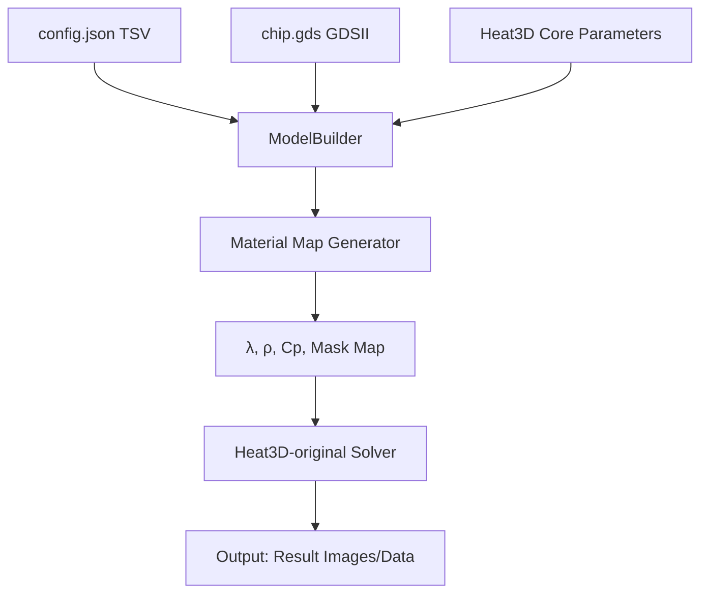

# Design: tsv-opt (Model Expansion)

## 1. システム・アーキテクチャ (System Architecture)

`Heat3D-original` のコアエンジンを維持しつつ、外部ファイルに基づいた「モデル生成レイヤー」を追加する。



## 2. 主要コンポーネント (Core Components)

### 2.1 Config Loader (`ConfigLoader.jl`)
- JSON ファイルから TSV の配置情報（座標、半径、本数）を読み込む。
- 将来的なレイヤー構成の拡張を見越したデータ構造を採用する。

### 2.2 GDSII Integration (`GDSLoader.jl`)
- `H2-main_TSV_Opt` の実装を参考にしつつ、GDSII ファイルの矩形情報を読み込み、指定されたシリコンチップレイヤーの物性値を更新するユーティリティ。

### 2.3 Model Manager (`ModelManager.jl`)
- `Heat3D-original` の `setMaterial!` や `setMask!` をラップし、以下の順序でグリッドを構築する：
    1.  背景物性（シリコン等）の初期化。
    2.  GDSII に基づくチップ内パターンの書き込み。
    3.  JSON に基づく TSV の上書き配置。
    4.  境界条件（Mask）の設定。

## 3. データ構造 (Data Structures)

```julia
struct TSVConfig
    num::Int
    radius::Float64
    positions::Vector{Tuple{Float64, Float64}} # (x, y)
end

struct SimulationModel
    grid_size::Tuple{Int, Int, Int}
    lambda::Array{Float64, 3}
    rho::Array{Float64, 3}
    cp::Array{Float64, 3}
    mask::Array{Float64, 3}
    # Future expansion: layers, etc.
end
```

## 4. 統合戦略 (Integration Strategy)

- **新規ディレクトリ `Heat3D-original/extensions/`**: コアエンジンを汚さないよう、追加機能をこの配下に配置。
- **メイン・エントリポイントの作成**: `Heat3D-original/run_expanded.jl` を作成し、ここから `ModelManager` と `heat3d.jl` のソルバーを呼び出す。
- **後方互換性**: 既存の `heat3d.jl` はそのまま実行可能とし、今回の拡張はオプトイン形式にする。

## 5. 検証計画 (Validation Plan)

1.  **TSV 配置テスト**: JSON で指定した座標に、正しく TSV の物性値が反映されているかを断面プロットで確認。
2.  **GDSII 読み込みテスト**: GDSII のパターンがチップレイヤーに正しく描画されているかを確認。
3.  **計算精度検証**: `Heat3D-original` の基本設定での実行結果と、拡張版で同様の条件を設定した場合の結果を比較し、誤差が許容範囲内であることを確認。
